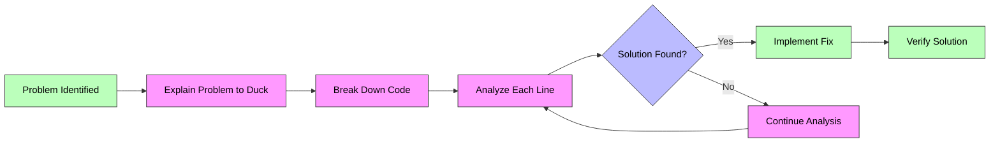

# Unit X Lecture X - Rubber Duck Debugging

Date: July 31, 2025

## Key Concepts

- Proin nec semper est. Vivamus quis feugiat urna. Vestibulum tincidunt laoreet augue eu feugiat.
- Ut vitae vehicula nulla. Fusce augue sapien, aliquam at ante sed, suscipit dictum urna. Curabitur quis ante laoreet,
  dapibus tellus vitae, scelerisque enim
- Donec venenatis pulvinar tortor vitae condimentum. Quisque ut consequat dolor, vitae ultricies erat. Duis vehicula
  tincidunt erat nec varius.

## What is a Rubber Duck?

## Direct Quote from Instructor

`
Maecenas suscipit aliquet mi, auctor venenatis massa rutrum ac. 
Integer sed iaculis felis, in consectetur nulla. 
Pellentesque sit amet nisl dui. Proin a velit id augue egestas elementum in nec nulla. 
Vestibulum nibh sapien, convallis at luctus id, tincidunt a dui
` - James the Wise

## Real-World Applications

* Morbi nulla nibh, eleifend quis feugiat non, pulvinar non ipsum. 
* Morbi congue orci tortor, et pulvinar orci posuere sed.
* Aliquam feugiat nec ante vel tempor. 
* Vivamus venenatis sed ex eget porta. 
* Fusce eget feugiat turpis. Pellentesque nec
* elementum nisl. Vestibulum eget lectus consectetur, vulputate elit a, aliquam orci.

## Personal Reflection

Today's lecture on rubber duck debugging really opened my eyes to how simple techniques can revolutionize
problem-solving approaches. What struck me most was how this method combines psychological principles with practical
application. The fact that explaining code to an inanimate object can actually improve understanding and reduce
debugging time is fascinating. I particularly appreciated how the technique forces developers to break down complex
problems into manageable pieces, often revealing solutions that weren't apparent before.

## Rubber Duck Debugging Process Flow

