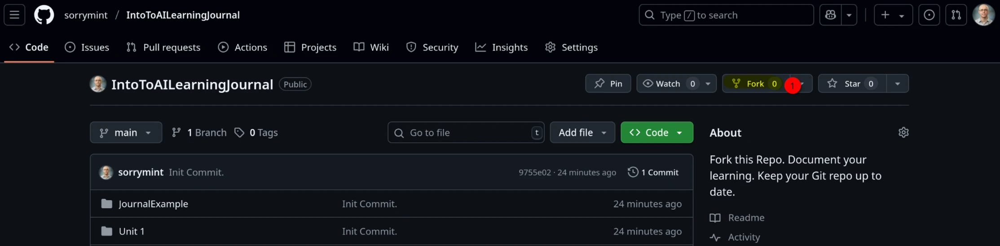
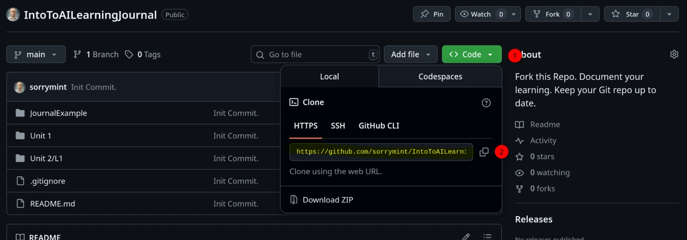

# Learning Journal 📓

Each lecture day of the IHCC CIS 114 Introduction to AI you will add to this learning Journal.
The idea of this journal is that by document your learning you will get more out of this class.
Each day document your learning during the lecture.

## "Giting" Set Up

Before getting started you will need a few accounts and software.
If you have developed software before, most of this you can skip.

- Make sure you have [Git](https://git-scm.com/downloads) downloaded to your local computer.
- If you don't already have one make
  a [GitHub](https://github.com/signup?ref_cta=Sign+up&ref_loc=header+logged+out&ref_page=%2F&source=header-home)
  account make one (don't use school email).
- You will need an IDE (coding text editor). If you don't have one I
  recommend [VSCode](https://code.visualstudio.com/download).

## Get your Copy

Now that you have Git installed and a GitHub accounts lets work to get you a copy of the Journal starter.

1. Fork this Repo. Call your fork what ever you like. You can make it public or pirate.
   
2. Click "Create Fork".
3. You should be taken you **YOUR** git repo. Notice that it has your username in the URL now.
4. Now clone **YOUR** forked repo. I will say this again **YOUR** repo. Start with getting the clone URL.
   
5. Now in your terminal. Run the following commands. Make sure you are in the folder you want to run the command. Your
   URL will be different.  
   
6. Open your Journal in your IDE of choice.

## Markdown

This Journal should be written in Markdown.
Don't worry if you have never used Markdown its easy.
[Here](https://www.markdownguide.org/cheat-sheet/) is a simple guide about markdown.
or look at the example below.

## Folder Structure

Each Unit make a new folder.
Each lecture should have its own folder as well.
Each lecture should have a markdown file `.md` and a `assets` folder for images (digram or reference).
Here is an example of the file structure. 

```
LearningJournal
│   README.md  
└───LU01
│   └───L1
│       │   journal.md
│       └───assets
│               image1.png
```

## Journal Example

Your journal can take many shapes.
Everyone's brain is different.
Do what makes the most sense to **YOU**.
But there are guidelines and an MVP.
You are required to include at least:

- Rough outline of notes however that makes sense to you. 
- Include at least one paragraph (3-5 sentences) of HUMAN written notes summarizing the lecture.
- A digram / Flow chart / Mind Map

For digrams, you can use anything.
I recommend:

- [Mermaid](https://github.blog/developer-skills/github/include-diagrams-markdown-files-mermaid/): you can write them
  right into your journal.
- [Excalidraw](https://excalidraw.com/): **MAKE SURE TO EXPORT AND LINK THE IMAGE IN YOUR JOURNAL**. Link it as an image
  in your markdown.

> 📓 Look [here](./JournalExample/example.md) for an example of a journal entry.

## Keeping your Journal Up to date

Once you clone down your Journal and start editing it I will want to see it.
So you need to upload (push) your new journal entry's up to GitHub (the remote).
To do this each lecture or unit you will need to follow the same flow.
While learning Git is important you only need to know the following commands for this class.

```bash
git add .
git commit -m "Added Unit 1 Lecture 1 Notes"
git push
```

> ⚠️ Each commit needs to have a custom and descriptive message.

## Rubric

Each Unit of this class I will look into your journal and give you participation credit.
While this journal is yours to personalize there some guidelines.
I will mostly be grading based on effort.

| Topic      | Task | Points |
|------------|------|--------|
| Retention  |      |        |
| Completion |      |        | 
| Creativity |      |        | 
